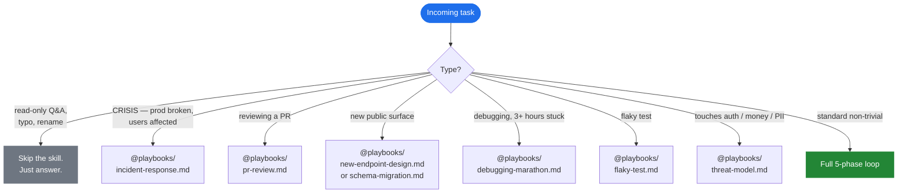

<div align="center">

# staff-engineer-mode

**A Claude Code skill that activates principal-engineer thinking on any non-trivial coding task.**

[](https://github.com/franciscolopes26/staff-engineer-mode/actions/workflows/ci.yml)
[](VERSION)
[](LICENSE)
[](CHANGELOG.md)
[](CONTRIBUTING.md)

*Read before write. State contracts. Pre-mortem failure modes. Small reversible steps. Verify behavior — not the build.*

Grounded **chapter-by-chapter** in 10 canonical engineering books.

</div>

---

> **Honest status.** v1.0.0 is theoretically grounded but **empirically unproven** — zero usage data outside the author's own machine. The `bench.md` evals confirm the SKILL.md *directs* the right behavior in 16/18 prompts (the 2 partials were closed pre-release); whether the right behavior consistently *produces* in real use is to be discovered through actual use. See [CHANGELOG.md](CHANGELOG.md) for known issues.

---

## Quick start

```bash
npx skills add https://github.com/franciscolopes26/staff-engineer-mode
```

Or inside any Claude Code session:

```text
/plugin marketplace add franciscolopes26/staff-engineer-mode
/plugin install staff-engineer-mode@staff-engineer-mode
```

That's it. The skill becomes available in subsequent sessions. Detailed install / update / uninstall instructions are in the [Installation](#installation) section.

---

## Table of contents

- [What this is](#what-this-is)
- [Who this is for](#who-this-is-for)
- [The 5-phase loop](#the-5-phase-loop)
- [What's inside](#whats-inside)
- [How this compares to other skills](#how-this-compares-to-other-skills)
- [Installation](#installation)
- [Canonical sources](#canonical-sources)
- [FAQ](#faq)
- [Roadmap](#roadmap)
- [Contributing](#contributing)
- [License & acknowledgements](#license--acknowledgements)

---

## What this is

A Claude Code skill that changes *how* the assistant approaches non-trivial engineering work. When loaded, it enforces a five-phase operating loop, runs a 30-item red-flag detection catalogue against every change, and routes incoming tasks to the right situation-specific playbook.

Two thin sentences:

1. **Most engineering mistakes are not from lack of knowledge — they are from skipping steps that competent engineers know they should take.** The skill exists to make those steps the default.
2. **Code is the artefact, judgment is the job.** The skill is the judgment layer — refuse work that shouldn't be done, name the trade-offs of work that should, verify what gets shipped.

## What this is not

- It is not a language-specific style guide. Pair with `coding-standards`, `nestjs-standards`, `python-patterns`, etc.
- It is not a code-review checklist. Pair with `code-reviewer` and `security-review`.
- It does not enforce specific line counts, naming conventions, or file structures.
- It does not replace human judgment — it makes the judgment more deliberate.

---

## Who this is for

| You are… | This skill changes… |
|----------|---------------------|
| A senior engineer who keeps shipping the right code but gets nervous about *how* you arrived at it | Makes the implicit discipline explicit and repeatable — 5 phases, 30 red flags, a Closing Gate before "done" |
| A staff/principal engineer reviewing AI-generated code | Gives Claude the discipline you'd want from a peer engineer — citations, calibrated reports, refusals when the framing is wrong |
| An engineering manager who wants more consistent quality from the team's AI tooling | A shared vocabulary (RF-IDs, phase names, calibrate levels) that travels across PRs and teammates |
| Someone learning to think like a staff engineer | A *grounded* curriculum — every principle traces back to a specific book chapter; the cognitive layers in `MINDSET.md` and `SECURITY.md` distil the actual mental moves |
| A solo founder coding alone | The "second pair of eyes" you don't have — pre-mortem, contract specification, calibration before declaring done |

---

## The 5-phase loop


Each phase has a tight rule, paste-able templates (`@scripts/contracts.md`, `@scripts/pre-mortem.md`, `@scripts/verify.md`), and direct citations to the source books.

The loop compresses for trivial work (a 30-second understand for a one-line fix) and expands for hard work (an hour of understanding for a migration). **The phases never disappear.**

The skill also routes incoming tasks via a Decision Tree:



---

## What's inside

```
staff-engineer-mode/                       (repo = plugin)
├── .claude-plugin/                        Plugin & marketplace manifests
├── .github/                               CI, issue templates, PR template,
│                                          CODEOWNERS, security policy
├── README, LICENSE, NOTICE,               Repo-level metadata
│   CONTRIBUTING, SUPPORT, CHANGELOG,
│   VERSION, .editorconfig
└── skills/staff-engineer-mode/            The skill itself
    ├── SKILL.md                           Operating mode — 5-phase loop,
    │                                      Iron Laws, 30 red flags,
    │                                      Decision Tree, C-Level Layer
    ├── MINDSET.md                         15 cognitive moves on software
    ├── SECURITY.md                        15 moves on attack surface + STRIDE
    ├── bench.md                           18 eval prompts to verify behavior
    ├── references/                        10 per-book digests with chapter
    │                                      citations and sources
    ├── scripts/                           5 engineering helpers + 5 C-level
    │                                      helpers (paste-able templates +
    │                                      1 bash script)
    ├── anti-patterns/                     18 anti-patterns with real code
    │                                      (TS / Python / Go)
    ├── playbooks/                         7 situation-specific recipes
    └── examples/                          1 worked walkthrough of the loop
```

By the numbers (v1.0.0):

| | Count |
|---|------:|
| Markdown files in the skill | 47 |
| Lines of skill content | ~5,400 |
| Canonical books cited | 10 |
| Red flags (RF-01 … RF-30) | 30 |
| Anti-patterns with code | 18 |
| Playbooks (situation recipes) | 7 |
| Helpers / paste-able templates | 10 |
| Bench evals (positive + negative) | 18 |
| CI jobs validating the repo | 4 |
| @-cross-references the CI checks | 160 |

The skill follows the **progressive disclosure** pattern: only SKILL.md's description (~100 tokens) loads at startup; the body (~3.4k tokens) loads when triggered; `references/`, `scripts/`, `anti-patterns/`, `playbooks/`, and `examples/` load only when referenced. **Total cost when idle: negligible.**

---

## How this compares to other skills

| Skill | What it does | What this one adds on top |
|-------|--------------|---------------------------|
| **anthropics/skills `skill-creator`** | Helps you author new skills | Not overlapping — `skill-creator` is meta-tooling; this skill is operating-mode content. |
| **obra/superpowers `test-driven-development`** | Enforces RED-GREEN-REFACTOR discipline | TDD is one slice of Phase 5 (verify behavior). This skill covers all 5 phases plus design-time discipline TDD doesn't address (contract specification, pre-mortem). |
| **obra/superpowers `systematic-debugging`** | Four-phase root-cause process | Maps almost 1:1 to this skill's `debugging-marathon` playbook + 3-strike rule. This skill embeds it as one playbook among 7. |
| **obra/superpowers `verification-before-completion`** | Forces "did the fix really work" gate | Embedded as Iron Law #3 and the Closing Gate checklist. |
| **wshobson/agents `code-review-excellence`** | 4-phase review with severity labels | Embedded as the `pr-review` playbook. This skill adds the *self-review* discipline (apply the loop to your own work before opening the PR). |
| **awesome-skills `code-review-skill`** | Heavy reference folder per language | Different angle — that skill is language-specific review; this one is language-agnostic operating mode. They compose. |

**The unique things this skill brings:**

1. **Citations chapter-by-chapter to 10 canonical books** — no other skill audited grounds its rules in primary sources. Each principle traces back to a specific chapter, audited via WebFetch against pragprog.com, abseil.io/resources/swe-book, refactoring.com, etc.
2. **Pre-mortem integrated into the workflow** as Phase 3 of every change — design-time risk analysis, not just reactive debugging.
3. **Contract-first thinking (Ousterhout) as Phase 2** — explicit pre/post/invariants + idempotency, concurrency, ordering, atomicity, authorization. Hyrum's Law surfaced.
4. **Reversibility classified into 4 tiers** with discipline matched to tier — irreversible actions get disproportionate scrutiny.
5. **Cognitive layers (`MINDSET.md` + `SECURITY.md`)** — 15+15 mental moves that separate principal-engineer thinking from senior-engineer thinking.
6. **A bench of 18 verifiable evals** with pass/fail behavior described — an independent agent eval against v1.0.0 SKILL.md returned 16 PASS, 2 PARTIAL, 0 FAIL (both partials closed pre-release).
7. **CI enforces the skill's own discipline** — cross-reference validator, manifest validator, find-callers smoke-test, VERSION sanity. Broken @-refs cannot be merged.

---

## Installation

### Option A — `npx skills` (recommended, community-canonical)

One command from your shell:

```bash
npx skills add https://github.com/franciscolopes26/staff-engineer-mode
```

If this is your first time using the `skills` CLI:

```bash
npx skills init
```

This is the convention used by [claudemarketplaces.com](https://claudemarketplaces.com/) and most public Claude Code skill collections.

### Option B — Claude Code plugin commands

Inside any Claude Code session:

```text
/plugin marketplace add franciscolopes26/staff-engineer-mode
/plugin install staff-engineer-mode@staff-engineer-mode
```

The plugin is cloned into `~/.claude/plugins/cache/`. Reload with `/reload-plugins` if needed.

### Optional — auto-load directive

Add to your `~/.claude/CLAUDE.md`:

```markdown
For any non-trivial coding task (debug, refactor, design, review),
load the `staff-engineer-mode` skill before starting.
```

### Updating

```text
/plugin marketplace update staff-engineer-mode
/plugin install staff-engineer-mode@staff-engineer-mode --force
```

### Uninstall

```text
/plugin uninstall staff-engineer-mode@staff-engineer-mode
/plugin marketplace remove staff-engineer-mode
```

### Manual install (for development / contributing)

```bash
git clone https://github.com/franciscolopes26/staff-engineer-mode ~/code/staff-engineer-mode
```

Then point Claude Code at the local plugin via `/plugin marketplace add ~/code/staff-engineer-mode`.

---

## Canonical sources

Every principle in this skill traces back to one of these ten books. Full citations with ISBNs in [NOTICE](NOTICE). Per-book digests with quotes and operational heuristics in [`skills/staff-engineer-mode/references/`](skills/staff-engineer-mode/references/).

| # | Book | Author | Why it's in this skill |
|---|------|--------|------------------------|
| 1 | The Pragmatic Programmer (20th Anniv.) | Hunt & Thomas | DRY, Tell-Don't-Ask, Crash Early, Tracer Bullets, Don't Program by Coincidence, Broken Windows |
| 2 | Clean Code | Robert C. Martin | Meaningful Names, function size, comment discipline, SOLID summary, Boy Scout Rule |
| 3 | Code Complete (2nd ed.) | Steve McConnell | Defensive Programming (barricades), table-driven methods, PPP, key construction decisions |
| 4 | A Philosophy of Software Design (2nd ed.) | John Ousterhout | Deep modules, complexity-cost model, strategic-vs-tactical, design-it-twice, define-errors-out-of-existence |
| 5 | Refactoring (2nd ed.) | Martin Fowler | Two Hats, Extract Function, smell catalogue, preparatory refactoring |
| 6 | The Mythical Man-Month | Fred Brooks | Brooks's Law, essential vs accidental complexity, No Silver Bullet, conceptual integrity, second-system effect |
| 7 | Designing Data-Intensive Applications | Martin Kleppmann | Reliability/scalability/maintainability, idempotency in distributed systems, Hyrum-Law-on-data, expand-and-contract migrations |
| 8 | Working Effectively with Legacy Code | Michael Feathers | Characterization tests, seams, Sprout method, "what is a unit test", change algorithm |
| 9 | Release It! (2nd ed.) | Michael Nygard | Stability patterns (Circuit Breaker, Bulkhead, Timeout, Steady State, Back-Pressure), antipatterns, design for production |
| 10 | Software Engineering at Google | Winters/Manshreck/Wright | Hyrum's Law, time × scale × trade-offs, sustainable engineering, code review as teaching |

---

## FAQ

### How is this different from just having Claude follow good practices generically?

A generic instruction like "be careful" is not action-able. The skill installs specific mechanisms: 30 numbered red flags with restart actions, a Common Rationalizations table that names the AI's likely self-talk, a Closing Gate checklist, paste-able templates for each phase. Specificity beats exhortation.

### Will it slow Claude down for simple tasks?

No — the Activation section and Decision Tree explicitly skip the skill for renames, typo fixes, one-line config changes, and read-only Q&A. Three of the 18 bench evals (B-15, B-16, B-17, B-18) test exactly this and the skill passes them.

### How much does it cost in tokens?

About **3.4k tokens** when the SKILL.md body loads (one-time per session when triggered). Reference files, scripts, playbooks, and examples load **only when explicitly invoked**, so the per-task cost stays bounded. The Anthropic-documented metadata startup cost is ~100 tokens.

### Is the "grounded chapter-by-chapter in 10 books" claim real?

Yes — and audited. An independent citation pass (via WebFetch against pragprog.com/tips, abseil.io/resources/swe-book, refactoring.com, web.stanford.edu/~ouster) verified 14 specific citations and flagged 6 errors. All 6 were corrected pre-release. The CI's `check_references.py` ensures every `@reference/<book>.md` link resolves to a real file.

### Why solo-skill instead of a multi-skill collection?

The community pattern is mixed. obra/superpowers and microsoft/azure-skills ship as multi-skill collections; anthropics/skills mixes both. This skill is intentionally a single super-skill with one unifying voice; the playbooks are situation recipes inside it, not separate skills. If you want only the incident-response or threat-modeling parts, you can copy those files individually.

### What's the difference between MINDSET.md and SECURITY.md?

Both are cognitive layers (15 mental moves each), but they target different domains. `MINDSET.md` covers software thinking in general (time horizons, compound cost, reversibility, trust as currency). `SECURITY.md` covers attack-surface thinking specifically (default-deny, AuthN ≠ AuthZ, trust boundaries, defense in depth, STRIDE). They compose.

### Will you accept PRs from the community?

Yes — see [CONTRIBUTING.md](CONTRIBUTING.md). The bar: every proposal needs a defensible citation. The skill is curated, not assembled-by-committee. PRs that add a red flag without a canonical source are deferred; PRs that close a real gap (broken cross-reference, citation error, new code example for an existing red flag) get fast-tracked.

### How do I verify the skill is actually changing behavior?

Run the 18 evals in [`skills/staff-engineer-mode/bench.md`](skills/staff-engineer-mode/bench.md) in a Claude Code session with the skill loaded. Each eval has a prompt, expected behavior, and the failure mode to watch for. A run-through takes ~15 minutes.

---

## Roadmap

**v1.0.x (current)** — bug fixes, citation corrections, broken-ref repairs.

**v1.1 — empirical hardening (next)**
- Use the skill in real PR reviews; capture each surprise as an Issue
- Add 2-3 more worked examples to `examples/` (only 1 today)
- Re-run bench eval after each non-trivial SKILL.md change
- Audit any remaining citations not in the v1 pass

**v1.2 — automation**
- GitHub Actions bench workflow that runs the 18 prompts against Claude API on a schedule; fails CI on regression
- Auto-update CHANGELOG via release-please or similar
- Spell-check workflow (only flagged, never auto-fixed)

**v2.0 — community-input cycle (after ≥500 installs)**
- Incorporate the top 10 most-cited skill-didn't-fire reports
- Open the design of any new red flags to the community
- Potential restructure as multi-skill collection if usage patterns show clear independent skill boundaries

The roadmap is aspirational and dependent on real usage. v1.0 is the gate where polish-in-isolation stops and feedback-driven iteration starts.

---

## Contributing

PRs welcome — see [CONTRIBUTING.md](CONTRIBUTING.md). Particularly wanted:

- Citation corrections (open with the verification source URL)
- New code examples for red flags that don't have one yet (12 of 30 RFs still lack a code example file)
- Playbook entries for situations the current 7 don't cover
- Translations of `SKILL.md` to other languages (references and citations stay in English because the books are English)
- Real-world feedback via the [skill-didn't-fire](.github/ISSUE_TEMPLATE/skill-didnt-fire.md) and [over-fired](.github/ISSUE_TEMPLATE/skill-over-fired.md) issue templates

See [SUPPORT.md](SUPPORT.md) for where each kind of question goes.

---

## License & acknowledgements

**License:** MIT — see [LICENSE](LICENSE). Cite the underlying books when you use a principle; they did the original work.

**Acknowledgements:**
- The 10 source authors — without their books this skill would be vibes (full attribution with ISBNs in [NOTICE](NOTICE))
- Jesse Vincent (obra/superpowers) — for the Iron Law / Red Flag / Decision Tree patterns this skill adapts
- Anthropic — for the Claude Code plugin format, the progressive-disclosure pattern, and the eval-driven skill-design guidance
- claudemarketplaces.com — for documenting the `npx skills add` install convention

---

<div align="center">

**A staff engineer is paid to refuse work that shouldn't be done, name the trade-offs of work that should, and verify the result of what gets shipped.**

*Code is the artefact. Judgment is the job.*

</div>
